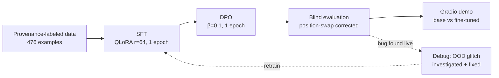

# twscholar-lm

**A fully-documented, end-to-end journey of building a Traditional Chinese
academic-writing assistant on a single consumer GPU (RTX 4070, 12GB) —
from hand-curated data through SFT and DPO, rigorous blind evaluation, and
a live demo, to two rounds of real debugging — including every failure
and dead end along the way.**

[Live results](results/) · [Dataset card](docs/DATASET_CARD.md) ·
[Data-writing guide](docs/DATA_GUIDE.md)

## What this is

A Traditional Chinese (Taiwan) academic-writing polisher: give it a rough,
colloquial draft sentence, get back a concise, formal version that reads
like it belongs in a journal paper.

```
draft:    我們發現受試者在做困難任務時,瞳孔會放大。
polished: 本研究結果顯示，受試者於執行困難任務時，瞳孔大小呈現增加趨勢。
```

## Why it's different

- **Traditional Chinese academic writing** — verified: no equivalent
  dataset exists on the Hub (checked before building this).
- **Full pipeline on one 12GB GPU** — every VRAM number below is measured,
  not estimated.
- **Honest failure log** — two independent "Debugging Alignment" chapters
  documenting real bugs found through rigorous evaluation and live testing,
  not glossed over.
- **Provenance-labeled data** — every training example is tagged with
  where it came from; ~42% of the polish targets are hand-authored by the
  project owner from their own research-writing experience, not
  AI-generated end to end.

## Pipeline



## Quick start

```bash
pip install -r requirements.txt   # then: pip install torch --index-url https://download.pytorch.org/whl/cu124

python scripts/build_training_set.py     # merges provenance-labeled raw data
python scripts/train_sft.py --mode lora --r 64 --alpha 128 --epochs 1 \
    --model_id Qwen/Qwen2.5-7B-Instruct --load_in_4bit --run_name sft-qlora-7b-epoch1
python scripts/prepare_dpo_data.py
python scripts/train_dpo.py --beta 0.1 --epochs 1 --load_in_4bit \
    --model_id Qwen/Qwen2.5-7B-Instruct \
    --sft_adapter_path outputs/sft-sft-qlora-7b-epoch1 --run_name dpo-qlora-7b-v2

python scripts/demo_app.py   # side-by-side demo at http://127.0.0.1:7860
```

## Dataset

476 examples, three provenance classes (full breakdown:
[docs/DATASET_CARD.md](docs/DATASET_CARD.md)):

| Source | Count | Share | What it means |
|---|---:|---:|---|
| `human_polished` | 199 | 41.8% | Claude drafted a colloquial rough sentence; **the author wrote every polished target** |
| `external_licensed` | 150 | 31.5% | Filtered [TaiwanChat](https://huggingface.co/datasets/yentinglin/TaiwanChat) subset, general conversational diversity |
| `ai_drafted_human_reviewed` | 127 | 26.7% | AI-drafted pairs, human-reviewed and edited |

⚠️ License: **cc-by-nc-4.0**, inherited from the `external_licensed`
(TaiwanChat) subset. The other two classes alone would be freely
relicensable — see the dataset card.

## Experiments

### Scale comparison (M2): 0.5B full-FT / 1.5B LoRA / 7B QLoRA

Controlled comparison, 3 epochs each, same 476-example dataset:

| Model | Trainable params | Peak VRAM | Time | Final loss |
|---|---:|---:|---:|---:|
| 0.5B full fine-tune | 494M (100%) | 5.0 GB | 117s | 1.61 |
| 1.5B LoRA r=64 | 74M (4.6%) | 6.07 GB | 224s | 0.97 |
| 7B QLoRA r=64 | 161M (2.1%) | 10.58 GB | 371s | 0.81 |

Capacity scales with model size even as the trainable-parameter *share*
shrinks. Notably, 0.5B full fine-tune fits comfortably in 12GB (5.0GB) —
in an earlier related project, 1.5B full fine-tune *overflowed* into
Windows' shared-memory fallback and ran 13× slower, which is why the
full-FT line here is capped at 0.5B (see Limitations).

### Production model: SFT + DPO, both at 1 epoch

| Stage | Peak VRAM | Time | Result |
|---|---:|---:|---|
| SFT (7B QLoRA r=64, 1 epoch) | 10.57 GB | 124s | loss 1.47 |
| DPO (β=0.1, 1 epoch) | 9.01 GB | 155s | reward accuracy 100%, margin 2.08 |

*Why 1 epoch for both stages, when SFT's loss was still falling at 3
epochs (0.81 vs. 1.47)? See "Debugging Alignment" below — it's not an
arbitrary choice.*

### Blind evaluation (M3): the honest result

50 held-out prompts, zero overlap with training. Blind head-to-head vs. the
**untuned base model**, with a position-swap consistency check (98% judge
self-agreement — confirming the raw slot tally wasn't position bias):

| | wins |
|---|---:|
| base model (zero-shot) | 25 |
| this model (SFT+DPO) | 22 |
| tie | 3 |

**Qwen2.5-7B-Instruct is already a strong Traditional Chinese academic
writer.** Fine-tuning did not produce a dramatic holistic-quality jump —
on blind preference, the two are roughly on par. What fine-tuning *does*
measurably buy: **Traditional-Chinese script consistency**. Objective,
judge-free metrics on the same 50 prompts:

| Condition | Simplified-char leakage (rows) |
|---|---:|
| base, zero-shot | 4/50 |
| base, few-shot | 3/50 |
| SFT | 0/50 |
| SFT+DPO | 0-1/50 |

This directly answers the standard interview question *"why fine-tune
instead of just prompting a strong model?"*: for a capable base model,
prompting gets most of the quality; fine-tuning buys a reliability
guarantee (here, script purity) that prompting doesn't. Full report:
[results/m3_eval_report.md](results/m3_eval_report.md).

## Debugging Alignment

Two independent rounds of real bugs, found through rigorous testing rather
than assumed away.

### Round 1 (inherited from the companion `dpo-lab` project)

- **β-sweep metric trap**: comparing raw DPO `rewards/margins` across
  β ∈ {0.05, 0.1, 0.5} suggested β=0.5 trained "hardest." Normalizing by β
  (which the metric is scaled by) showed the opposite — β=0.5 actually
  diverged *least* from the reference policy.
- That normalized reading motivated a wrong fix hypothesis (raise β to
  reduce drift) — **tested and disproved**: β=0.5 held-out generation was
  *worse* (44.0 avg length vs. 36.8 for β=0.1, and new failure modes:
  English/Cyrillic mixed into output).
- Root-caused instead via a **checkpoint-intensity diagnostic**: simplified-
  character leakage tracked training steps monotonically (2 → 10 → 13
  hits across increasing epochs), even though every training example was
  clean Traditional Chinese. Fix: fewer DPO epochs (3 → 1).
- Also ruled out "Qwen2.5's pretraining is mostly Simplified Chinese" as
  the cause by testing the **untuned** base model directly (99% Traditional
  on neutral prompts) — the leakage was induced by fine-tuning, not
  inherited from pretraining.

### Round 2 (found live in *this* project, this session)

- Manual demo testing (not the eval suite) surfaced an informal-question
  input (`所以我們目前的進度到底怎樣`) that triggered a token-level glitch:
  "完成" garbled into "完cheng" (a stray pinyin fragment).
- Retroactively found the *same* glitch already sitting in M3's raw eval
  data, unflagged — a miss worth admitting.
- An initial hypothesis ("informal questions/requests are broadly
  unstable") was **tested and rejected**: a battery of 15 new
  question/request examples produced zero glitches. The failure is
  narrower than a whole input category.
- Root-caused via the *same* checkpoint-intensity method as Round 1: glitch
  count rose monotonically with training exposure (0/2 → 1/2 → 1/2 → 2/2).
  Same underlying mechanism as Round 1 (narrow-dataset fine-tuning
  destabilizes properties never directly targeted, worsening with more
  steps), different symptom.
- Fix: **SFT also needed 1 epoch**, not just DPO — the first time this
  project applied the lesson to the earlier pipeline stage. Validated with
  0 glitches / 0 simplified-char hits across 50 held-out prompts plus a
  15-item OOD battery, with no visible quality regression despite a
  *higher* training loss (1.47 vs. 0.81) — loss and real robustness
  diverged here.

Full writeup: [results/m4_ood_glitch_investigation.md](results/m4_ood_glitch_investigation.md).

## Demo

`scripts/demo_app.py` — Gradio, side-by-side base vs. fine-tuned, with a
live Traditional-Chinese purity badge on each output (using the same
detector as the eval suite). One 4-bit weight copy serves both columns
(`disable_adapter()` toggles between them, ~6.5GB peak VRAM).

Input guardrails (added after live testing surfaced degenerate behavior on
edge-case input): minimum/maximum length checks and a CJK-content ratio
check, each with a plain-language explanation instead of a raw error or
silent failure.

## Limitations

- 476 training examples is small-scale; a real product would need far more.
- Full fine-tuning comparison capped at 0.5B — 1.5B overflowed 12GB into
  Windows' shared-memory fallback in earlier testing (13× slower, not OOM).
- Rare generation glitches on far-out-of-distribution input cannot be ruled
  out beyond what was explicitly tested.
- Single judge (Claude) for the blind evaluation; a human panel or a
  second model would strengthen it.
- cc-by-nc-4.0 license (from the TaiwanChat subset) limits commercial reuse
  of the merged dataset/models as published.

## Hardware

Single NVIDIA RTX 4070 (12GB VRAM, WDDM). Measured footprints: 7B 4-bit
inference 5.6GB · 7B QLoRA SFT 10.57GB · 7B QLoRA DPO 9.01GB · demo (dual
generation, one weight copy) 6.5GB.

## Status

- [x] M0 — repo skeleton + GitHub online
- [x] M1 — dataset v1 (476 examples, provenance-labeled + 50 held-out)
- [x] M2 — training: 0.5B full-FT / 1.5B LoRA / 7B QLoRA (SFT) + DPO
- [x] M3 — blind randomized evaluation w/ position-swap correction
- [x] M4 — demo + OOD debugging round + production model finalized
  - [ ] HF Hub upload (blocked on a write-scoped token; everything staged — see `scripts/upload_to_hub.py`)
- [ ] M5 — interview-readiness (whiteboard derivations of LoRA parameter
  counts and the DPO loss, done by the project owner, not delegated)

## License

Code: MIT. Data/models: cc-by-nc-4.0 (see dataset card for why, and how to
reconstruct a commercially-reusable subset).
