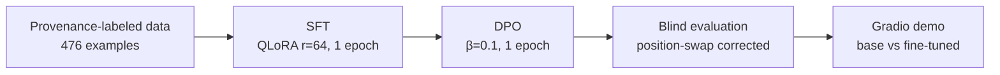

# twscholar-lm

**A Traditional Chinese (Taiwan) academic-writing assistant, fine-tuned
end-to-end on a single consumer GPU (RTX 4070, 12GB).**

[Results](results/) · [Dataset card](docs/DATASET_CARD.md) ·
[Data-writing guide](docs/DATA_GUIDE.md)

## What this is

A Traditional Chinese (Taiwan) academic-writing polisher: give it a rough,
colloquial draft sentence, get back a concise, formal version that reads
like it belongs in a journal paper.

```
draft:    我們發現受試者在做困難任務時,瞳孔會放大。
polished: 本研究結果顯示，受試者於執行困難任務時，瞳孔大小呈現增加趨勢。
```

## Why it's different

- **Traditional Chinese academic writing** — verified: no equivalent
  dataset exists on the Hub (checked before building this).
- **Full pipeline on one 12GB GPU** — every VRAM number below is measured,
  not estimated.
- **Provenance-labeled data** — every training example is tagged with
  where it came from; ~42% of the polish targets are hand-authored by the
  project owner from their own research-writing experience, not
  AI-generated end to end.

## Pipeline



## Quick start

```bash
pip install -r requirements.txt   # then: pip install torch --index-url https://download.pytorch.org/whl/cu124

python scripts/build_training_set.py     # merges provenance-labeled raw data
python scripts/train_sft.py --mode lora --r 64 --alpha 128 --epochs 1 \
    --model_id Qwen/Qwen2.5-7B-Instruct --load_in_4bit --run_name sft-qlora-7b-epoch1
python scripts/prepare_dpo_data.py
python scripts/train_dpo.py --beta 0.1 --epochs 1 --load_in_4bit \
    --model_id Qwen/Qwen2.5-7B-Instruct \
    --sft_adapter_path outputs/sft-sft-qlora-7b-epoch1 --run_name dpo-qlora-7b-v2

python scripts/demo_app.py   # side-by-side demo at http://127.0.0.1:7860
```

## Dataset

476 examples, three provenance classes (full breakdown:
[docs/DATASET_CARD.md](docs/DATASET_CARD.md)):

| Source | Count | Share | What it means |
|---|---:|---:|---|
| `human_polished` | 199 | 41.8% | Claude drafted a colloquial rough sentence; **the author wrote every polished target** |
| `external_licensed` | 150 | 31.5% | Filtered [TaiwanChat](https://huggingface.co/datasets/yentinglin/TaiwanChat) subset, general conversational diversity |
| `ai_drafted_human_reviewed` | 127 | 26.7% | AI-drafted pairs, human-reviewed and edited |

⚠️ License: **cc-by-nc-4.0**, inherited from the `external_licensed`
(TaiwanChat) subset. The other two classes alone would be freely
relicensable — see the dataset card.

📦 On the Hub: [dataset](https://huggingface.co/datasets/Yoda6131027/twscholar-lm-dataset)

## Experiments

### Scale comparison (M2): 0.5B full-FT / 1.5B LoRA / 7B QLoRA

Controlled comparison, 3 epochs each, same 476-example dataset:

| Model | Trainable params | Peak VRAM | Time | Final loss |
|---|---:|---:|---:|---:|
| 0.5B full fine-tune | 494M (100%) | 5.0 GB | 117s | 1.61 |
| 1.5B LoRA r=64 | 74M (4.6%) | 6.07 GB | 224s | 0.97 |
| 7B QLoRA r=64 | 161M (2.1%) | 10.58 GB | 371s | 0.81 |

Capacity scales with model size even as the trainable-parameter *share*
shrinks.

### Production model: SFT + DPO

| Stage | Peak VRAM | Time | Result |
|---|---:|---:|---|
| SFT (7B QLoRA r=64, 1 epoch) | 10.57 GB | 124s | loss 1.47 |
| DPO (β=0.1, 1 epoch) | 9.01 GB | 155s | reward accuracy 100%, margin 2.08 |

### Blind evaluation (M3): the honest result

50 held-out prompts, zero overlap with training. Blind head-to-head vs. the
**untuned base model**, with a position-swap consistency check (98% judge
self-agreement):

| | wins |
|---|---:|
| base model (zero-shot) | 25 |
| this model (SFT+DPO) | 22 |
| tie | 3 |

**Qwen2.5-7B-Instruct is already a strong Traditional Chinese academic
writer.** Fine-tuning did not produce a dramatic holistic-quality jump —
on blind preference, the two are roughly on par. What fine-tuning *does*
measurably buy: **Traditional-Chinese script consistency**. Objective,
judge-free metrics on the same 50 prompts:

| Condition | Simplified-char leakage (rows) |
|---|---:|
| base, zero-shot | 4/50 |
| base, few-shot | 3/50 |
| SFT | 0/50 |
| SFT+DPO | 0-1/50 |

This directly answers the standard question *"why fine-tune instead of
just prompting a strong model?"*: for a capable base model, prompting gets
most of the quality; fine-tuning buys a reliability guarantee (here,
script purity) that prompting doesn't. Full report:
[results/m3_eval_report.md](results/m3_eval_report.md).

## Demo

`scripts/demo_app.py` — Gradio, side-by-side base vs. fine-tuned, with a
live Traditional-Chinese purity badge on each output. One 4-bit weight
copy serves both columns (`disable_adapter()` toggles between them,
~6.5GB peak VRAM).

## Models

| Adapter | HF Hub |
|---|---|
| SFT+DPO (recommended, final) | [twscholar-lm-dpo-7b-final](https://huggingface.co/Yoda6131027/twscholar-lm-dpo-7b-final) |
| SFT only, 7B | [twscholar-lm-sft-7b-qlora-r64](https://huggingface.co/Yoda6131027/twscholar-lm-sft-7b-qlora-r64) |
| SFT only, 1.5B (scale comparison) | [twscholar-lm-sft-1.5b-lora-r64](https://huggingface.co/Yoda6131027/twscholar-lm-sft-1.5b-lora-r64) |

## Hardware

Single NVIDIA RTX 4070 (12GB VRAM, WDDM). Measured footprints: 7B 4-bit
inference 5.6GB · 7B QLoRA SFT 10.57GB · 7B QLoRA DPO 9.01GB · demo (dual
generation, one weight copy) 6.5GB.


## License

Code: MIT. Data/models: cc-by-nc-4.0 (see dataset card for why, and how to
reconstruct a commercially-reusable subset).
